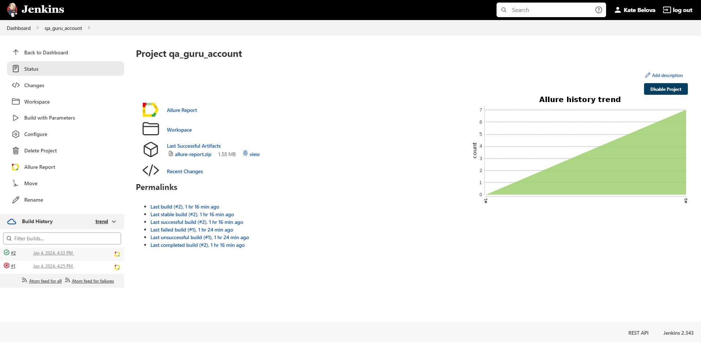
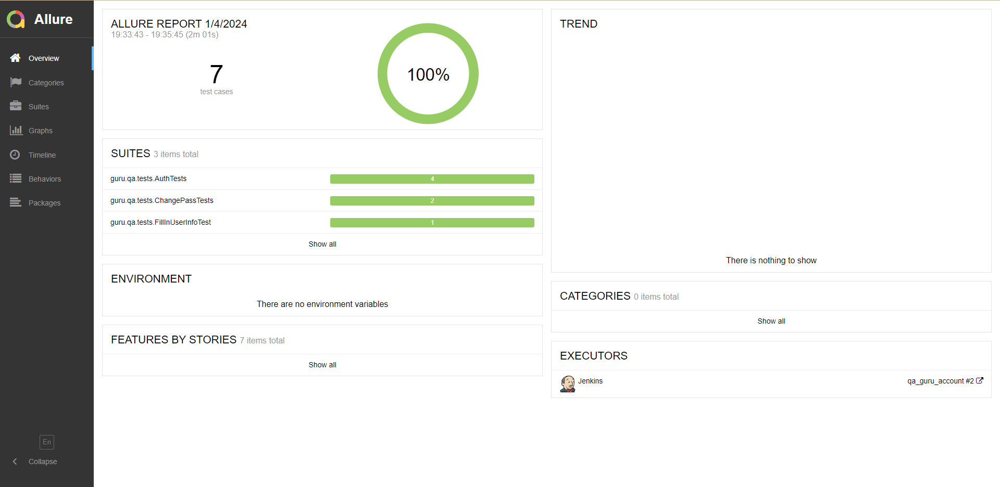
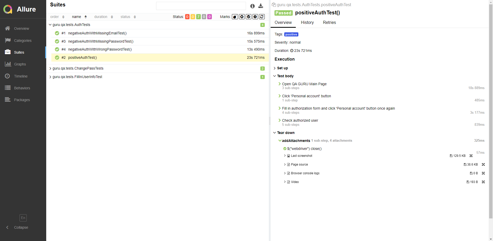
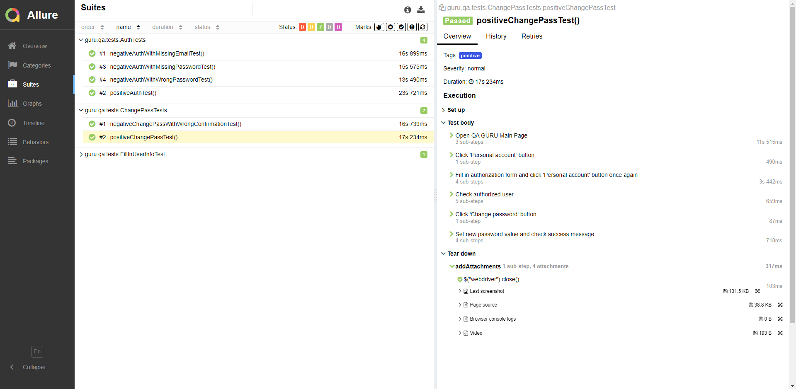
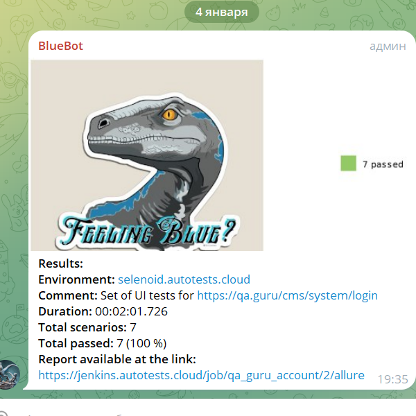
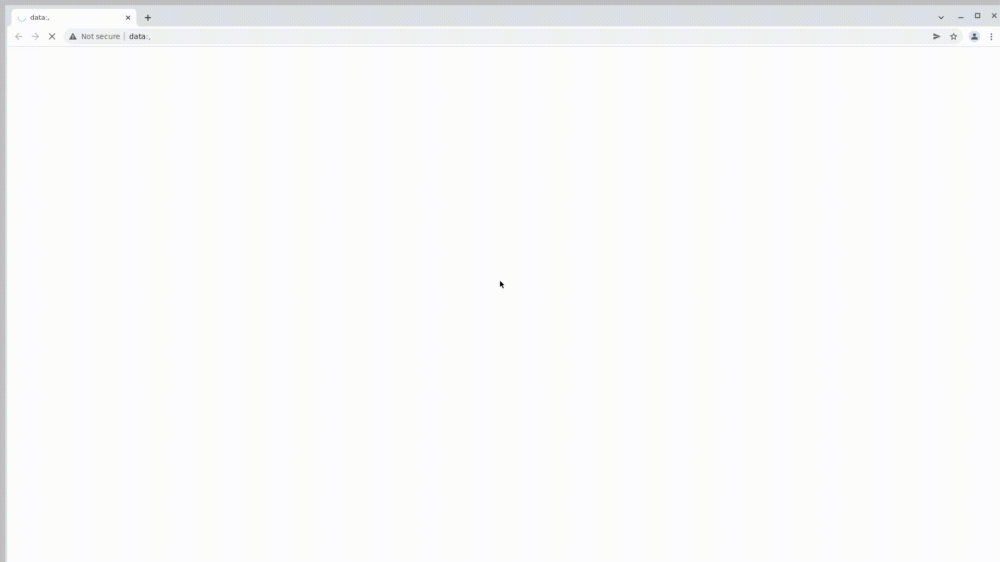

# Проект автоматизации тестирования личного кабинета <p align="center"> [](https://qa.guru) </p>

> [QA GURU](https://qa.guru) - школа инженеров для автоматизации тестирования.

____

> ## :ballot_box_with_check: <a name="Содержание">**Содержание:**</a>

* <a href="#tools">Технологии и инструменты</a>

* <a href="#cases">Примеры автоматизированных тест-кейсов</a>

* <a href="#jenkins">Сборка в Jenkins</a>

* <a href="#console">Запуск тестов из терминала</a>

* <a href="#allure">Allure отчет</a>

* <a href="#telegram">Уведомление в Telegram с помощью бота</a>

* <a href="#video">Примеры видео выполнения тестов на Selenoid</a>

____

<a id="tools"></a>
> ## :ballot_box_with_check: <a name="Технологии и инструменты">**Технологии и инструменты:**</a>

<p  align="center"

<code><a href="https://www.java.com/"></a></code>
<code><a href="https://www.jetbrains.com/idea/"></a></code>
<code><a href="https://gradle.org/"></code></a>
<code><a href="https://junit.org/junit5/"></a></code>
<code><a href="https://selenide.org/"></a></code>
<code><a href="https://aerokube.com/selenoid/"></a></code>
<code><a href="https://github.com/"></a></code>
<code><a href="https://github.com/allure-framework"></a></code>
<code><a href="https://www.jenkins.io"></a></code>
<code><a href="https://web.telegram.org"></a></code>

</p>

- В данном проекте автотесты написаны на <code>Java</code> с использованием фреймворков [Selenide](https://selenide.org/) и [JUnit 5](https://junit.org/junit5/).
- Для сборки проекта был использован [Gradle](https://gradle.org/).
- При удаленном запуске тестов браузер запускается в [Selenoid](https://selenoid.autotests.cloud/).
- Удаленный запуск реализован в [Jenkins](https://jenkins.autotests.cloud/) с формированием <code>Allure</code>-отчета.
- Подключена отправка уведомлений о результатах запуска сборки в <code>Telegram</code> при помощи бота.

Содержание Allure-отчета:

* Шаги теста;
* Скриншот страницы на последнем шаге;
* Page Source;
* Логи браузерной консоли;
* Видео выполнения автотеста.

____

<a id="cases"></a>
> ## :ballot_box_with_check: <a name="Примеры автоматизированных тест-кейсов">Примеры автоматизированных тест-кейсов:</a>

- Тест на авторизацию с корректными логином и паролем;
- Проверка невозможности авторизации с неверным паролем;
- Проверка невозможности авторизации с незаполненным полем логина и пароля;
- Тест на смену пароля в личном кабинете;
- Проверка невозможности изменить пароль, если в поле подтверждения он не идентичен введенному ранее;
- Тест на возможность изменять и сохранять данные в личном кабинете студента школы;

____

<a id="jenkins"></a>
> ##  Сборка в [Jenkins](https://jenkins.autotests.cloud/job/qa_guru_account)

Для запуска сборки необходимо перейти в раздел <code>Build with Parameters</code> и нажать кнопку <code>Build</code>.

<p align="center">

</p>

### **Параметры сборки:**

* <code>BASE_URL</code> – главная страница веб-сайта.
* <code>REMOTE_URL</code> – адрес удаленного сервера, на котором запускаются тесты.
* <code>BROWSER</code> – браузер, в котором выполняются тесты. По-умолчанию - <code>chrome</code>.
* <code>BROWSER_SIZE</code> – размер окна браузера. По-умолчанию - <code>1920x1080</code>.

После выполнения сборки в блоке <code>Build History</code> напротив номера сборки появляется значок <code>Allure Report</code>, 
при клике на который открывается страница со сформированным html-отчетом.
____

<a id="console"></a>
> ## :ballot_box_with_check: <a name="Запуск тестов из терминала">**Запуск тестов из терминала:**</a>

### Команда для терминала IDE для локального запуска тестов:

```
gradle clean test
```

### Команда для терминала IDE для удаленного запуска тестов в [Selenoid](https://selenoid.autotests.cloud/):

```
gradle clean test -Denv=remote
```

Также можно переопределить параметры запуска:

```
clean
${TASK}
-DbaseUrl=${BASE_URL}
-DremoteUrl=${REMOTE_URL}
-Dbrowser=${BROWSER}
-DbrowserSize=${BROWSER_SIZE}
```

____

<a id="allure"></a>
> ## </a> <a name="Allure"></a>Allure [Report](https://jenkins.autotests.cloud/job/qa_guru_account/2/allure/)</a>

### Основная страница отчёта

<p align="center">  
  
</p>  

### Тест-кейсы

<p align="center">  
  


</p>

____

<a id="telegram"></a>

##  Уведомления в Telegram с помощью бота

После завершения сборки созданный в <code>Telegram</code> бот автоматически обрабатывает результаты и отправляет
уведомление со ссылкой на отчет.

<p align="center">

</p>

____

<a id="video"></a>

## Видео примера запуска тестов в Selenoid

К каждому тесту в отчете прилагается видео его выполнения.
<p align="center">

</p>

